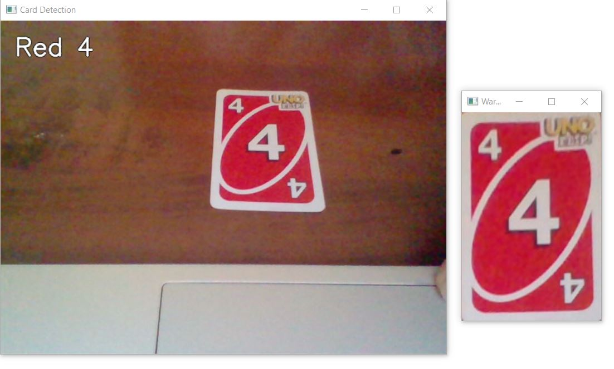

# UNO Card Detection 🟥🟨🟩🟦

A Python-based project for detecting and recognizing UNO cards in real-time using computer vision techniques.

## Features

- Detects UNO cards from images or webcam.
- Recognizes card number/symbol using SIFT-based template matching.
- Identifies dominant card color using HSV masking.
- Includes perspective transform for accurate preprocessing.
- Modular codebase (each task handled in separate scripts).

## Project Structure

```
   ├──templates/ → Preprocessed UNO card templates  
   ├──main.py → CLI entry point to run webcam or image detection
   ├──app_ui.py → Tkinter-based GUI for user-friendly interface
   ├──ui.py → Handles user input, image/webcam routing
   ├──feature_matching.py → SIFT + BFMatcher for card feature detection 
   ├──colour_detection.py → Detects card color using HSV masks
   ├──card_detection.py → Finds card contours and applies perspective corrections
   ├──utils.py → Helper utilities (resizing, dilation, overlay text)
   ```

---

## Setup Instructions

1. Clone this repository:
   ```bash
   git clone https://github.com/AiswaryaShajan/UNO_Card_Detection.git
   cd UNO_Card_Detection
2. Install Dependencies
   ```bash
   pip install -r requirements.txt
3. Running the Program
   ```bash
   python3 app_ui.py
   ```
    You’ll be prompted to choose between webcam or image-based detection.

## How It Works
- 🃏 Card Detection
    - The input image or webcam frame is scanned for contours. The largest quadrilateral contour is assumed to be the card.
    - A transformed (flattened) image of the card is generated using `cv2.warpPerspective`
      

- 🌈 Color Detection (HSV Masking)
   - The card image is converted to HSV color space, which allows for more accurate color segmentation than RGB. Each UNO card color   (Red, Green, Blue, Yellow) has predefined HSV value ranges. For each color:
    - A binary mask is created using `cv2.inRange()`.
    - The number of matching pixels is counted.
    - The color with the highest pixel count is returned as the detected card color


- Feature Matching
    - To recognize the number or symbol on a detected UNO card:

    - The input card is converted to grayscale, and SIFT (Scale-Invariant Feature Transform) is used to extract keypoints and descriptors.
    - The card is compared against a set of preloaded templates (grayscale images of known UNO cards).
    - For each template:
        -SIFT descriptors are computed.
        -Feature matching is performed using Brute-Force Matcher with knnMatch() and Lowe’s ratio test (0.75 threshold).
    - The template with the highest number of good matches is selected as the recognized card.
    - This method is scale- and rotation-invariant, and works well with clear, upright cards against a simple background.

- Label Overlay
    - The detected color and card name (e.g., "Red 4") are drawn on the output frame.

- Output
     
     

## Areas of Improvement

1. **Performance**:  
   - The program can be **slow** at times, especially during processing. Exploring optimizations in the code or using hardware acceleration (e.g., GPU) could help improve speed and responsiveness.

2. **Accuracy in Number Recognition**:  
   - There are occasional mix-ups with certain numbers, such as **`6` and `9` or `1` and `7`**. Refining the feature matching or improving the template designs could help reduce these errors.

3. **Color Detection**:  
   - The system sometimes struggles to distinguish between colors like **green and yellow**. Adjusting the HSV thresholds or incorporating more advanced color classification methods could enhance reliability.

4. **Background Dependency**:  
   - The program performs best when cards are placed against a dark background. Adding better background segmentation or preprocessing techniques might make it more adaptable to different environments.

## What Next? 🔍:  
   - Train a machine learning model for classifying the cards for more robust detection.


